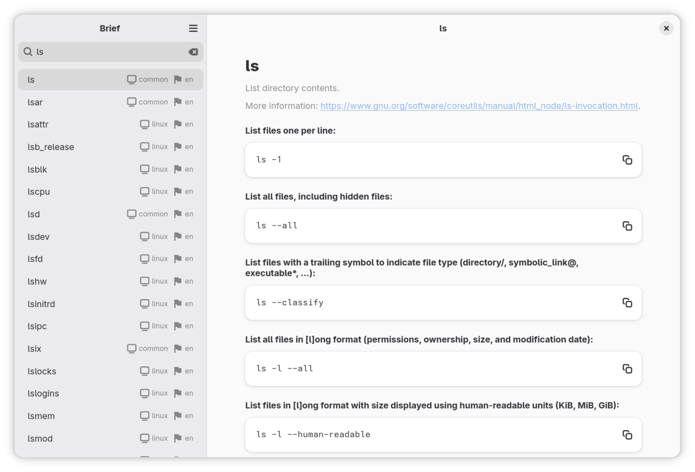

# Brief

Brief is a GTK4 application for browsing [tldr-pages](https://github.com/tldr-pages/tldr). It provides a clean, native interface to view community-maintained help pages for command-line tools.

## Features

- Built with GTK4 and Libadwaita for a seamless GNOME experience.
- Works offline with cached pages.
- Filter platform-specific commands (Linux, Windows, Android, etc.).
- Browse commands in multiple languages.

## Roadmap

- `Ctrl+F` shortcut to focus search input. (Enter + up, down to navigate thru - already exists)
- Option to update cache with the latest tldr-pages.
- GNOME Search integration ([docs](https://developer.gnome.org/documentation/tutorials/search-provider.html)).
